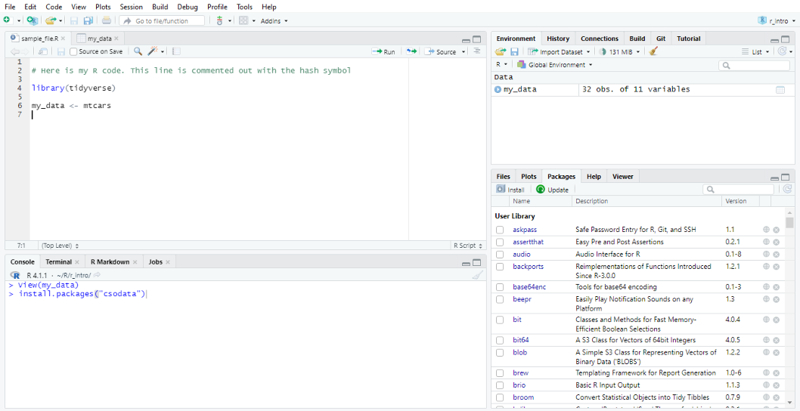

```{r setup, include=FALSE}
knitr::opts_chunk$set(echo = TRUE)
```

```{=html}
<style>
div.blue { background-color:#e6f0ff; border-radius: 5px; padding: 20px;}
</style>
```

## Introduction

R is a flexible, convenient and powerful tool for managing and analysing data, and well as for creating publication materials such as visualisations, reports and dashboards. RStudio is an IDE (Integrated Development Environment) for using R. R is free to install, as is the open source edition of RStudio (there are professional and hosted versions of RStudio which are not free). In my opinion, R and RStudio provide at least as much of the functionality you would see in other quite expensive statistical computing platforms. 

### Packages and Tidyverse

The capabilities of R are extended through a wide array of packages. As a beginner with R, most, if not all, of the packages you use will be downloaded from an online repository of packages called CRAN, which stands for the Comprehensive R Archive Network. Packages are downloaded from CRAN within the R environment, you rarely have to visit the CRAN website at all. There is a stringent process to getting your package included on CRAN which includes a series of checks and testing, so there is a very low likelihood of you ever downloading malicious code from CRAN.

Tidyverse is a very widely used collection of packages which makes it easier to write and read code in R. It is so commonly used that it is almost ubiquitous, so I wouldn't hesitate to recommend that you begin learning R through tidyverse. If you are not using tidyverse and you are only using the handful of default packages in R then you would say that you are using 'base R', where 'base' is the main default package (I think there are seven default packages). It is good to understand the functionality of base R, but I think it's ok to pick this up as you go along rather than starting out with exclusive use of base R.

To install a package you use the function `install.packages`, so to install the tidyverse packages you run `install.packages("tidyverse")`. Then to use the package you have to load it into your environment using the function `library`, so to use the tidyverse functions and features you run `library(tidyverse)` (note you need inverted commas for `install.packages` but not for `library`). **You only have to install a package once, or again if you want to update the package, but you have to load the package every time you start a new session in R**. 

Within tidyverse there are eight core packages, and then a couple of extra packages and some back-end packages. All of these are installed when you run `install.packages("tidyverse")`, but only the core packages are loaded when you run `library(tidyverse)`. This is not something that you have to worry too much about, it just means that you have to run an extra `library` line when you want to use one of those extra packages beyond the core tidyverse packages.

## Getting help

The help function in R provides great documentation and examples for all functions. Use it by running `?` followed by the name of the function. For example, to find out more about the function `select` just run `?select`.

There are very good [cheatsheets for different packages on the RStudio website](https://www.rstudio.com/resources/cheatsheets/). One cheatsheet that you won’t find on that page but which I think is really useful for beginners is [the one on data wrangling](https://www.rstudio.com/wp-content/uploads/2015/02/data-wrangling-cheatsheet.pdf).

Finally there are a couple of good online forums where users post their coding problems and other users try to provide solutions. One of the most active of these is Stack Overflow. Try searching or posting your problem there if you are getting stuck. Users are more likely to be able to help if you provide a reproducible example, so try to provide enough code so that they can recreate the problem themselves. 

## The RStudio environment

A screenshot of RStudio is shown below. There are four main panels. This guide will not go through every single feature in RStudio, but will hopefully be enough to get you started. 

- The top left panel is where you write and run code and where you view your datasets. You can open up a new scripting window by clicking File > New File > R Script (or 'Ctrl Shift n'). You can save these as '.R' files. To run code in this panel you have a couple of options. My preferred way is to select the block of code that I want to run and hit 'Ctrl Enter'. If you don't select a block of code then it will run whatever line your cursor is on, and helpfully, the cursor automatically jumps on to the next line. Equivalent to hitting 'Ctrl Enter' is hitting the 'Run' button with the green arrow to the top. To run all of the code in the script window, you can press 'Ctrl Alt r'. To view datasets in this window you can click them in the 'Environment' panel (top right) or run `View(dataset_name)`. 
- The bottom left panel is the console, which does two things. The first is that it outputs useful information after you have run some code, such as warnings or any print statements. The second thing is that you can also write code here. Generally I would write code in the Console if I didn't care about not having access to that code again, so I might run quick spot checks in the console, and it is also where I would run code for installing packages. There are tabs for 'Terminal', 'R Markdown' and 'Jobs' which you don't need to worry about for now.
- I would call the top right panel the environment panel, even though 'Environment' is only one of the six tabs in that panel, because I have never used the other five tabs. The environment panel shows you all the datasets and other variables that you have created. There is a blue arrow next to the datasets which allows you to browse their structure. Note that there are some datasets which exist and which you can use, but they don't appear in the environment panel. These are usually associated with training or as demo datasets to play with a package. One of these is `mtcars`, which contains information on 32 cars. In the code in the screenshot, I have used `mtcars` to make a new duplicate dataset called `my_data` which does appear in the environment panel.
- The bottom right panel shows plots and help, and also allows you to browse files and installed packages. I don't think it is too difficult to find your way around this panel. If you create a plot or run a help command then the appropriate tab will become active. 



## A word on web restrictions

R needs to access the web in order to download packages from CRAN. You may also want to import data from the web, e.g. through the csodata package for importing data from the CSO website. If you are having trouble with these steps then it may be because your organisation has not allowed R to access the web, so you might need to contact your IT department. If you are in the same organisation as me and you are experiencing difficulties, let me know, there are some settings that I can pass on that will help. 

## Making objects

## Drop, keep and rename variables

## Filter

## New variables

## Counting and summarising

## Combining datasets

## Sorting and row-wise operations

## Converting and rounding

## Dealing with strings

## File I/O

